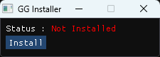
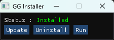
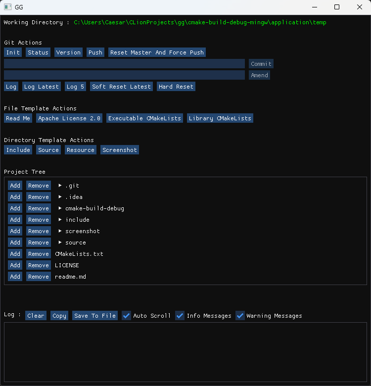

# GG
A basic git gui frontend (gg means git gui) that fits
my specific needs on personal single-programmer projects.
I made it specifically for my use case but made it FOSS
in case it ever fits someone else's. Windows only.
The code follows the RAD approach bc this isn't made for
production so don't expect high reliability on edge cases.

### Building

- Generate for either MSVC or MinGW-w64
- Build target `application`
- Build target `installer`
- Run `gg-installer.exe` from the output directory

### Screenshots

### Donate

<i>
    <h3 align="center" style="margin-top: 0px; padding-top: 0px">
        PayPal
    </h3>
</i>

    <a href="https://www.paypal.com/cgi-bin/webscr?cmd=_s-xclick&hosted_button_id=E4MPSYVCAYYSS">
        <image 
            src="https://www.paypalobjects.com/en_US/FR/i/btn/btn_donateCC_LG.gif" 
            border="0"
            name="submit"
            title="PayPal - The safer, easier way to pay online!" 
            alt="Donate with PayPal button" 
        />
    </a>

